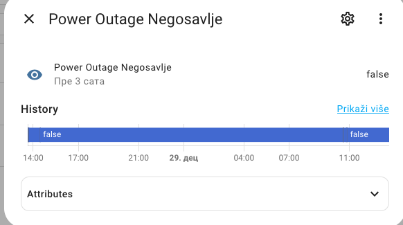
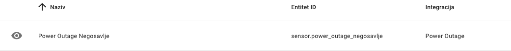

# Bez Struje Scraper za Home Assistant

Ova integracija omogućava praćenje planiranih isključenja električne energije za područje ED Leskovac, sa posebnim fokusom na naselje Negosavlje.

## Instalacija

1. Napravite novi folder `python_scripts/bez_struje` u vašem Home Assistant konfiguracionom direktorijumu
2. Kopirajte fajl `power_outage_scraper.py` u taj folder

### Konfiguracija u configuration.yaml

```yaml
sensor:
  - platform: power_outage
```
Sada je potrebno dodati custom component u Home Assistant. Najednostavnije koristiti Studio Code server integraciju za ovo. 

### Finalni korak
Restartuje Home Assistant. U integracijama treba da se pojavi nova integracija `Power Outage` i senzor `power_outage`.






#### Opcionalno, Alerting

```yaml
alias: Bez struje
description: Send notification when power outage is scheduled for Negosavlje
triggers:
  - entity_id: sensor.power_outage_negosavlje
    to: "true"
    trigger: state
conditions: []
actions:
  - action: notify.habot
    data:
      message: |-
        
          
          ⚡️ Isključenje struje - Negosavlje
          📅 Datum: {{ outage.date }}
          ⏰ Vreme: {{ outage.time }}
          ℹ️ Detalji: {{ outage.description }}
          
        
mode: single
```
